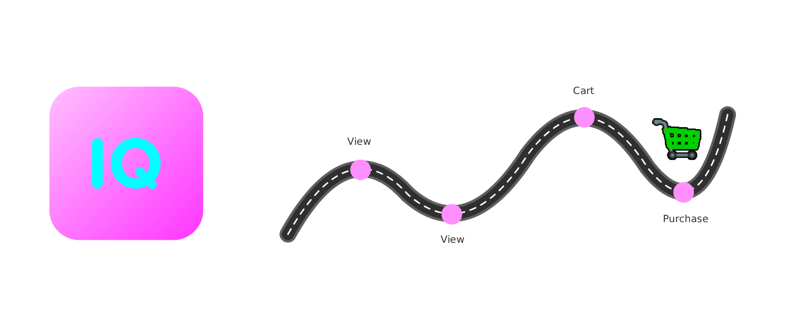

# ConvertIQ - E-Commerce Purchase Prediction

<p align="center">
  
</p>

**ConvertIQ** predicts whether an e-commerce user will make a purchase within the next 2 days, based on their browsing behavior. The project covers the full ML pipeline: data processing, feature engineering, model training, API deployment, and a simple web interface.

> Final project for Le Wagon Data Science & AI bootcamp (team of 4).
> The entire project was built without AI assistance for learning purposes, except for this README and some test notebooks.

---

## Key Results

| Metric | Baseline | Final Model |
|--------|----------|-------------|
| ROC-AUC | 0.759 | **0.799** |
| PR-AUC | 0.172 | **0.199** |
| Recall | 0.536 | **0.666** |

The model identifies **~67% of future buyers** from behavioral signals, using LightGBM with class imbalance handling.

---

## Architecture

```
Kaggle Dataset (1M+ events)
      |
      v
  Data Cleaning ──> Feature Engineering (20+ features) ──> LightGBM Model
                                                                |
                                                                v
                                                          FastAPI (REST)
                                                                |
                                                                v
                                                       Streamlit Frontend
```

---

## Dataset

- **Source**: [Kaggle - eCommerce behavior data](https://www.kaggle.com/datasets/mkechinov/ecommerce-behavior-data-from-multi-category-store) (October 2019)
- **Size**: 1M+ e-commerce events (views, cart additions, purchases)
- **Scope**: Filtered to top 5 product categories

## Feature Engineering

Features are computed per user over an observation window (before Oct 6, 2019):

| Category | Features |
|----------|----------|
| **Event counts** | total_events, total_views, total_carts, total_purchases |
| **Ratios** | view_to_cart_ratio, cart_to_purchase_ratio |
| **Session stats** | avg/median/max session duration, avg/max events per session |
| **Engagement** | n_sessions, n_days_active |
| **Behavior flags** | has_ever_carted, has_ever_purchased |
| **Time** | hour, day of week, is_weekend |

Labels: whether the user made a purchase during the prediction window (Oct 6-8, 2019).

---

## Installation

### Prerequisites

- Python 3.10+
- pip

### Setup

```bash
# Clone the repository
git clone https://github.com/AdriMottainai/convertiq.git
cd convertiq

# Install dependencies
pip install -r requirements_prod.txt
pip install -e .
```

### Configuration

Copy `.env.sample` to `.env` and fill in your values:

```bash
cp .env.sample .env
```

---

## Usage

### Run the API locally

```bash
make run_api
# or
uvicorn convertiq_py.api.fast:app --reload
```

The API exposes a `POST /predict` endpoint that accepts a CSV file with user event data.

### Run the Streamlit app

```bash
export API_URL=http://localhost:8000
streamlit run convertiq_py/app/app.py
```

### Docker

```bash
docker build -t convertiq .
docker run -p 8000:8000 -e PORT=8000 convertiq
```

---

## Project Structure

```
convertiq/
├── convertiq_py/
│   ├── ml_logic/
│   │   ├── data.py             # Data loading (Kaggle) & cleaning
│   │   ├── preprocessor.py     # Feature engineering pipeline
│   │   ├── model.py            # LightGBM model init & training
│   │   ├── train.py            # Training orchestration
│   │   ├── evaluate.py         # Model evaluation (ROC-AUC)
│   │   └── registry.py         # Model save/load (joblib)
│   ├── api/
│   │   └── fast.py             # FastAPI prediction endpoint
│   ├── app/
│   │   └── app.py              # Streamlit web interface
│   ├── save_models/            # Trained model artifacts
│   └── params.py               # Configuration & constants
├── prod_notebook/              # Production model training notebook
├── test_notebook/              # Exploration & experiment notebooks
├── data_streamlit/             # Frontend assets & demo data
├── Dockerfile
├── Makefile
├── requirements_prod.txt
├── requirements_dev.txt
└── setup.py
```

---

## Tech Stack

- **ML**: LightGBM, scikit-learn, pandas, NumPy
- **API**: FastAPI, uvicorn
- **Frontend**: Streamlit
- **Deployment**: Docker, Google Cloud Run
- **Data**: Kaggle API (kagglehub)

---

## Team

Built by **Adrien Roggero**, **Glen Hellio**, **Sophie Bréand**, and **Dominique Turpin** during "Le Wagon Data Science & AI bootcamp".

---

## License

This project is licensed under the MIT License - see the [LICENSE](LICENSE) file.
